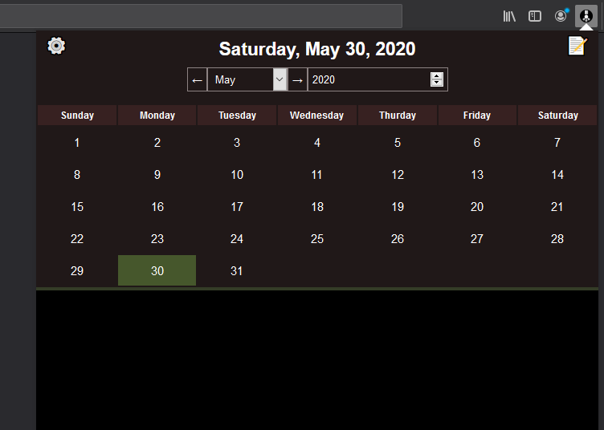

# domodel-diary-extension

Browser extension context for [domodel-diary](https://github.com/thoughtsunificator/domodel-diary)

- Calendar
- Daily notes encrypted using AES
- Password Protected

Available on:

- [Firefox](https://addons.mozilla.org/en-US/firefox/addon/domodel-diary/)
- [Chrome](https://chrome.google.com/webstore/detail/domodel-diary/hncoaagegcdnajffjpkldhfceipfgnnf)

## Getting started

### Installing

### Run

- ``npm install``
- ``npm start``

### Build

- ``npm install``
- ``npm run build``
